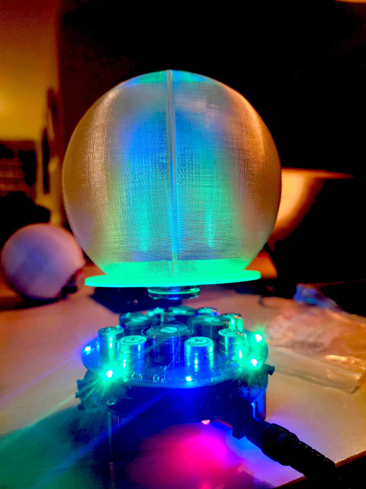
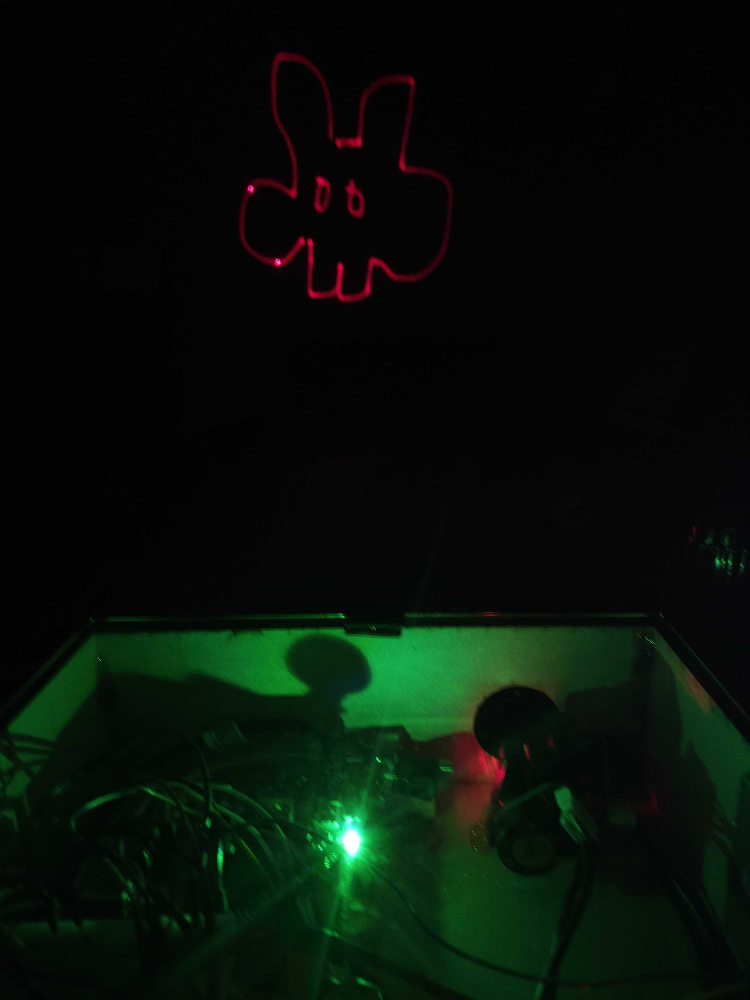

# HoloGlobe

An insanely impractical 3D hologram rotating sphere POV (persistence of vision)

## What does it do?

It spins a frame mount of programmable leds and updates insanely fast so that an image
is formed on a spherical shape. Due to the persistent nature of the eye, this is perceived
by the viewer as a floating semi-transparent image.

## How is it done?

Mainly 3d-print and lasercut, an RC speedboat engine and some rough electronics.
The spinning frame is made by two programmable led strips handled by a Raspberry PI

## What can it show?

Spherical shapes mapped out on a 50x100 matrix, globes, death stars, heads, whatever.
Image upload system is in progress...

## Is it dangerous?

Yes, it may actually burn up. That's why it needs to be contained.

## Other noteworthy projects

Coming to the skaperfestival 25

*Deichman LED wall* : programmable 2x3 meters led wall made by cups and leds

*Hoverglobe* : floating illuminated sphere using magnets and leds

*laserprojector* :

Galvo Laser projects for projecting drawings with laser on wall or similar

## Documentation

[Separate documentation](docs/Documentation.md)

## Prerequisites

* Raspberry with installed Raspbian Bookworm (RPI3b+ or newer 64bit)
* 3D-printer access
* lasercutter access
* coding skills

[more info](docs/Prerequisites.md)
